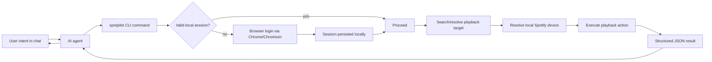

# Spotpilot Business Overview

## 1) What Spotpilot Is

Spotpilot is a local CLI that lets an AI agent control Spotify playback in a deterministic, scriptable way.

- The **agent** handles natural language understanding.
- Spotpilot handles **reliable execution** of playback actions.

In business terms, Spotpilot is an execution adapter between user intent and Spotify playback, optimized for local-machine control and predictable automation.

## 2) Why It Exists

Users want to say things like “play Master of Puppets” to an agent and have it work immediately.

Without Spotpilot, agent integrations tend to be:

- brittle (inconsistent command behavior),
- hard to validate (unclear success/failure contracts),
- not automation-friendly (ad-hoc outputs instead of stable JSON).

Spotpilot solves this by enforcing strict command behavior, stable outputs, and a narrow v1 scope.

## 3) Who It Serves

### Primary users

- Agent users on macOS/Linux who want local Spotify control.
- Developers building or integrating AI agents that execute terminal tools.

### Secondary stakeholders

- Maintainers who need stable interfaces (commands, flags, output, exit codes).
- Tooling/CI owners who require deterministic checks and reproducible behavior.

## 4) Product Value Proposition

### Functional value

- One command per action (`play`, `pause`, `resume`, `next`, `previous`, `status`, `login`, `version`).
- Predictable login/session behavior.
- Local-device-first playback behavior.

### Operational value

- JSON-first output envelope for machine consumption.
- Stable, parseable error categories and exit behavior.
- Thin architecture that is easy to reason about and extend.

## 5) End-to-End Business Flow

## 6) Core v1 Experience (Business Perspective)

### First successful run

- User runs `spotpilot play "..."`.
- If not logged in, login is auto-triggered.
- Session is persisted for future commands.
- Original play intent resumes automatically.

### Repeat usage

- Most commands should complete without visible setup friction.
- User receives concise success/failure result through the agent.

### Read-only visibility

- `status` provides state visibility without side effects.

## 7) Scope Boundaries (Intentional Non-Goals)

v1 intentionally excludes:

- interactive disambiguation prompts,
- playlist/queue management,
- remote device takeover,
- broad browser import support beyond Chrome/Chromium.

This keeps reliability and implementation risk controlled while validating core usage.

## 8) Business Risks and Mitigations

### Risk: authentication friction

- Mitigation: auto-triggered login and persisted session storage.

### Risk: playback on wrong device

- Mitigation: local-machine-first device policy and bounded recovery flow.

### Risk: agent integration ambiguity

- Mitigation: stable command contracts and JSON envelope as primary interface.

## 9) Success Signals

Useful v1 health indicators:

- % of `play` commands succeeding without manual retry,
- median command completion time,
- % of commands requiring re-login,
- frequency of `not_found` vs successful matches,
- incidence of fallback-to-web-player paths.

## 10) One-Sentence Summary

Spotpilot turns agent intent into reliable, local Spotify playback actions through a narrow, deterministic CLI contract designed for automation-first workflows.
