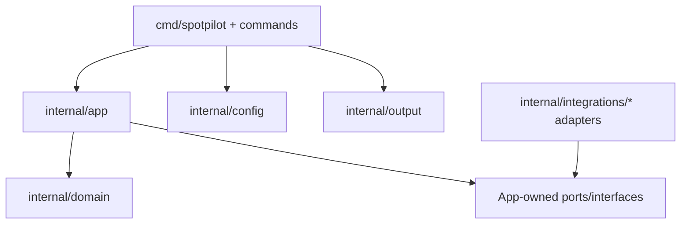
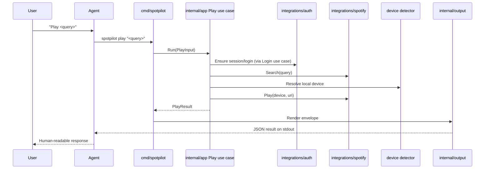
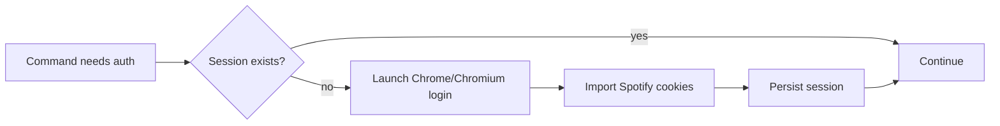

# Architecture Walkthrough

This document explains how Spotpilot works at runtime, complementing the technical baseline in this directory.

## 1) System Intent

Spotpilot is a single-binary Go CLI with a thin command layer over application use cases, domain models, and integration adapters.

Primary architectural objective:

- deterministic command execution for agent-driven workflows.

## 2) Layered Architecture

Dependency direction is intentionally inward (`cmd -> app -> domain`) with adapters implementing app-owned ports.

## 3) Package Responsibilities (Practical View)

- `cmd/spotpilot`: command registration, flag parsing, dependency wiring, use-case invocation.
- `internal/app`: orchestration, workflow composition (for example auto-login), app ports.
- `internal/domain`: core playback entities and domain-level concepts.
- `internal/integrations/auth`: browser-driven session capture + storage adapters.
- `internal/integrations/spotify`: Spotify search/playback/connect adapters.
- `internal/integrations/browser`: browser discovery/launch behavior.
- `internal/config`: typed config loading + precedence handling.
- `internal/output`: envelope rendering (JSON default, plain mode optional).

## 4) Runtime Flow: `play`

## 5) Login and Session Model

Key technical points:

- Session persistence is adapter-owned (`auth` integration).
- Play-like commands can compose login workflow in app layer.
- `status` remains side-effect free by design.

## 6) Output and Error Contract

All commands map to a standard envelope with required fields:

- `ok`, `command`, `state`, `message`, optional `result`.

Rendering rules:

- JSON is default on `stdout`.
- `--plain` renders concise human text from the same result model.
- Human diagnostics stay on `stderr`.

Error handling shape:

- app/domain errors are translated at the boundary,
- stable categories and exit-code semantics are maintained for automation.

## 7) Configuration Resolution

The effective config model follows precedence:

1. flags,
2. env vars,
3. config file,
4. defaults.

This keeps command behavior explicit and predictable for both humans and agents.

## 8) Why This Design Works for Agents

- Commands are narrow and deterministic.
- Side effects are isolated behind ports/adapters.
- Output is machine-first and stable.
- Command layer is thin, reducing hidden behavior.
- Workflows like auto-login are explicit in application orchestration.

## 9) Extension Points

Low-risk future extensions fit naturally at boundaries:

- add new commands by composing existing/app ports,
- add new adapters under `internal/integrations` without leaking vendor types,
- expand output payloads while preserving top-level envelope,
- evolve auth/session internals without changing command UX.

## 10) Operational Notes

CI and local verification should validate the same concerns:

- format check,
- lint,
- tests,
- build.

This alignment keeps behavior consistent from local development through GitHub Actions.
